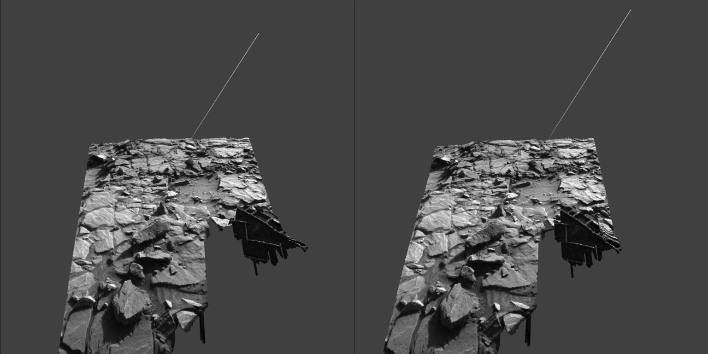

# Threejs-VR-Curiosity-Navcams (updating)

Explore Curiosity Navcams 3D images in Oculus Quest.

Stereoscopic view. 

# Threejs-VR-Curiosity-Navcams Pages

[https://physicslibrary.github.io/Threejs-VR-Curiosity-Navcams/](https://physicslibrary.github.io/Threejs-VR-Curiosity-Navcams/)

# Hardware

Oculus Quest tested (6DoF headset/controllers). 

# Software

Oculus Browser (tested Quest update > 17.0).

# Installation

No installation. 

In Oculus Quest, open Oculus Browser and link (let browser finish loading before "Enter VR"). 

[https://physicslibrary.github.io/Threejs-VR-Curiosity-Navcams/examples/threejs_vr_curiosity_sol1151.html](https://physicslibrary.github.io/Threejs-VR-Curiosity-Navcams/examples/threejs_vr_curiosity_sol1151.html)

File sol1151_wheel_measure.glb shows one of Curiosity's six wheels on the lower right. Any Navcam image with wheel(s) is selected because a wheel is used in Blender to scale the 3D mesh. The author of Blender-Navcam-Importer has stated that, "resulting mesh...is in no way scientifically accurate". Nevertheless, the result does not appear distorted or unusual.

If no Oculus Quest (tested 2018 9.7" iPad/iPadOS 13/Safari, Windows 10/Google Chrome/Firefox, Raspberry Pi 3 B+/Raspbian Buster). 

[https://physicslibrary.github.io/Threejs-VR-Curiosity-Navcams/examples/threejs_curiosity_sol1151.html](https://physicslibrary.github.io/Threejs-VR-Curiosity-Navcams/examples/threejs_curiosity_sol1151.html)

# Stereoscopic view of Sol 1431

Let browser finish loading before "Enter VR". 

[https://physicslibrary.github.io/Threejs-VR-Curiosity-Navcams/examples/threejs_vr_curiosity_sol_1431.html](https://physicslibrary.github.io/Threejs-VR-Curiosity-Navcams/examples/threejs_vr_curiosity_sol_1431.html)

In front are two images combined as one stereoscopic view using three.js. The left and right Navcams are separated by 42 centimeters apart so it is not what a person would see standing there, someday. Humans IPD averages from 5.1 to 7.7 cm. 

The image on the left is a monoscopic view of NLB_524534514EDR_F0562034NCAM00280M_.jpeg. 

The 3D model on the right is constructed from two images NLB_524534514EDR_F0562034NCAM00280M_.jpeg and NRB_524534514EDR_F0562034NCAM00280M_.jpeg using Blender-Navcam-Importer. 

This project uses images taken by Curiosity Navcams. 

https://mars.nasa.gov/

Lot of excellent materials. Do a search for "raw images". 

http://mars.jpl.nasa.gov/msl/multimedia/raw/

The Sol 1431 VR experience is created from left image. 

https://mars.nasa.gov/msl-raw-images/proj/msl/redops/ods/surface/sol/01431/opgs/edr/ncam/NLB_524534514EDR_F0562034NCAM00280M_.JPG

And by changing "NLB" to "NRB", get corresponding right image. 

https://mars.nasa.gov/msl-raw-images/proj/msl/redops/ods/surface/sol/01431/opgs/edr/ncam/NRB_524534514EDR_F0562034NCAM00280M_.JPG

Sometimes a left image is available but a matching right image is not available. Move to other images. 

Curiosity's location for Sol 1431. 

https://mars.nasa.gov/resources/curiosity-rovers-location-for-sol-1431/

Artist's scaled image for Sol 1432. 

https://www.planetary.org/multimedia/space-images/mars/sean-doran-astronaut-sol1432ml002.html

# Making Sol 1151 .glb (Feb 20, 2020)

# References

Images NLB_524534514EDR_F0562034NCAM00280M_.JPG and NRB_524534514EDR_F0562034NCAM00280M_.JPG 
Courtesy NASA/JPL-Caltech. 

JPL Image Use Policy 
https://www.jpl.nasa.gov/imagepolicy/

Go to Curiosity, Multimedia, Raw Images in link: 

[https://mars.nasa.gov/msl/home/](https://mars.nasa.gov/msl/home/) 

Or Sol images for left navigation camera: 

[Curiosity Left Navigation Camera](https://mars.jpl.nasa.gov/msl/multimedia/raw-images/?order=sol+desc%2Cinstrument_sort+asc%2Csample_type_sort+asc%2C+date_taken+desc&per_page=50&page=0&mission=msl&af=NAV_LEFT_A%7CNAV_LEFT_B%2C%2C%2C) 

To find the image used to make sol1151_wheel_measure.glb, enter 1151 for Sol and sort by "oldest to newest". It should be the 13th image (2015-11-01T21:33:08.000Z). 

[Raw image used to make sol1151_wheel_measure.glb](https://mars.jpl.nasa.gov/msl-raw-images/proj/msl/redops/ods/surface/sol/01151/opgs/edr/ncam/NLB_499684496EDR_F0501222NCAM00354M_.JPG) 

A Blender addon is used to import Curiosity Navcams. 

[https://github.com/phaseIV/Blender-Navcam-Importer](https://github.com/phaseIV/Blender-Navcam-Importer)

The Blender-Navcam-Importer github has an excellent introduction about the addon. 

Blender 2.82 is used to export "glTF Binary" sol1511-wheel-measure.glb with Decimate Modifier(Ratio 0.1) and Draco compression. 

[https://www.blender.org/](https://www.blender.org/)

[https://mars.nasa.gov/msl/spacecraft/rover/cameras/#navcams](https://mars.nasa.gov/msl/spacecraft/rover/cameras/#navcams)

[https://mars.nasa.gov/msl/spacecraft/rover/wheels/](https://mars.nasa.gov/msl/spacecraft/rover/wheels/)

[https://threejs.org/](https://threejs.org/)

[https://github.com/mrdoob/three.js/](https://github.com/mrdoob/three.js/)

Three.js examples is the best place to learn and experiment: 

[https://github.com/mrdoob/three.js/tree/dev/examples](https://github.com/mrdoob/three.js/tree/dev/examples)

Three.js' excellent documentation on how to convert WebGL examples to WebVR: 

[https://threejs.org/docs/index.html#manual/en/introduction/How-to-create-VR-content](https://threejs.org/docs/index.html#manual/en/introduction/How-to-create-VR-content)

Three.js example of how to load .glb file: 

[https://github.com/mrdoob/three.js/blob/dev/examples/webgl_loader_gltf.html](https://github.com/mrdoob/three.js/blob/dev/examples/webgl_loader_gltf.html)

https://en.wikipedia.org/wiki/Pupillary_distance

 Copyright (c) 2020 Hartwell Fong
